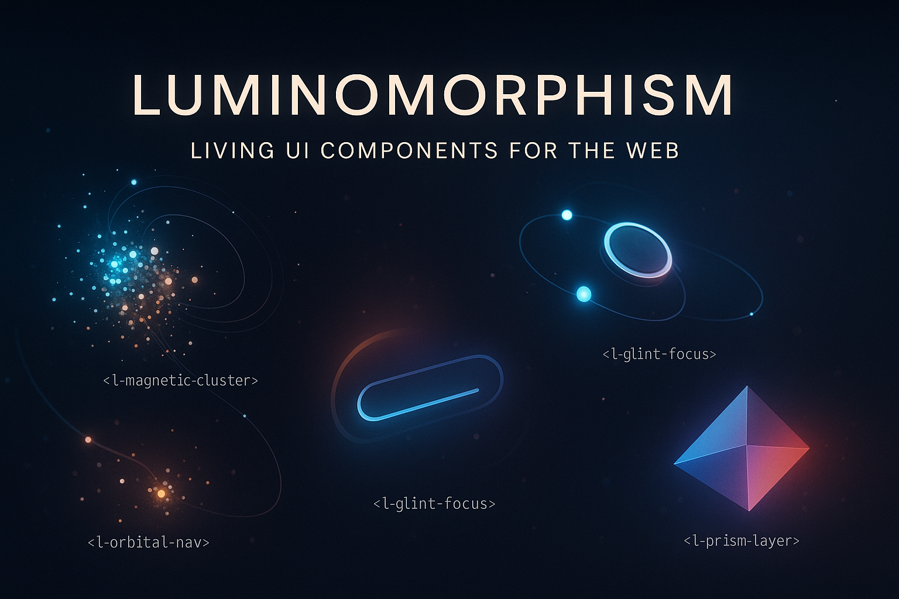

# 🌟 Luminomorphism

[](https://www.npmjs.com/package/luminomorphism)
[](https://github.com/victortutu-hub/luminomorphism/blob/main/LICENSE)
[](https://www.npmjs.com/package/luminomorphism)
[](https://github.com/victortutu-hub/luminomorphism/stargazers)
[](https://bundlephobia.com/result?p=luminomorphism)



**Luminomorphism** is a UI design library that turns interface elements into interactive, glowing, behavior-rich visual entities. Inspired by light, memory, and motion, it introduces a new category of web components: **living interfaces**.

> ✨ It's not a theme or framework. It's reactive visual cognition.

---

## 🚀 Why Luminomorphism?

* ✅ 100% original Web Components
* 🔦 Light is behavior, not decoration
* 🎨 Ideal for expressive, creative, and futuristic UIs
* ⚙️ Zero dependencies — pure JS + CSS
* 📱 Mobile-ready and performance-optimized

---

## 🧰 Published Components


## 🧠 New Component in v1.1.11

### `<l-magnetic-cluster>`

A multi-agent simulation with **magnetic fields**, **quantum behavior**, and **emotional contagion**. Particles respond to the cursor and to each other using behaviors like boids logic, quantum tunneling, breathing rhythm, and memory echoes.

- 🧲 Magnetic attraction/repulsion with Verlet integration
- 🧬 Quantum state flipping, entanglement, and trace particles
- 😮 Emotional states with collective field dominance and mutation
- 🫧 Echoes of past positions to simulate temporal memory

**Demo:** [Demo](https://victortutu-hub.github.io/luminomorphism/labs/l-magnetic-cluster.html)


### `<l-particle-net-v3>`

An advanced particle system that integrates **temporal memory**, **field reactivity**, and a **learning mechanism**. Each node accumulates excitation history and connection density to determine whether it has "learned" — changing its glow dynamically.

- 🧠 Interaction-based learning and memory
- 🔄 Adaptive motion fields with user or autopilot input
- ✨ Visual differentiation of learned vs. unlearned particles via dynamic glow

**Demo:** [Demo](https://victortutu-hub.github.io/luminomorphism/labs/l-particle-net-v3.html)


### `<l-neural-growth>`

A biologically-inspired component that simulates **neural branching and synapse formation** in real time. It is the first UI component of its kind to dynamically grow connections, pulsate energy, and display visual memory through glow-enhanced animation.

- 🧬 Procedural neuron growth
- 🔁 Animated bidirectional synapses with flowing light
- ⚡ Emergent structure and interaction-driven memory

> No dependencies. Rendered via 2D canvas with glow-enhanced animation. Optimized for ambient dark interfaces.

**Demo:**  
🔗 [https://victortutu-hub.github.io/luminomorphism/labs/l-neural-growth.html](https://victortutu-hub.github.io/luminomorphism/labs/l-neural-growth.html)

---

### 🧬 About Innovation & Originality

> While similar visual techniques (e.g., branching animations, canvas glow, sinusoidal pulse) have appeared in isolated demos or experiments, `<l-neural-growth>` represents a **novel synthesis**: the **first known reusable Web Component** to procedurally simulate neural growth, animated synapses, and memory-like glow dynamics — all wrapped into a **native, zero-dependency UI element**.
>
> This originality is not in any single technique, but in the **coherent behavioral design**: an interactive system where visual structure *grows*, *connects*, *remembers*, and *reacts* — forming a living presence on screen.
>
> Whether seen as art, interface design, or simulation, `<l-neural-growth>` contributes a **distinct category** of interface logic: a biologically-inspired, reactive, and memory-infused UI component.

### 🔮 Core Interactives

| Component              | Description                                      | Demo                                                                                 |
| ---------------------- | ------------------------------------------------ | ------------------------------------------------------------------------------------ |
| `<l-orbital>`          | Circular glowing orbs                            | [Demo](https://victortutu-hub.github.io/luminomorphism/labs/l-orbital.html)          |
| `<l-orbital-quantum>`  | Quantum orbital behavior with entropy            | [Demo](https://victortutu-hub.github.io/luminomorphism/labs/l-orbital-quantum.html)  |
| `<l-orbital-nav>`      | Navigation with orbital buttons                  | [Demo](https://victortutu-hub.github.io/luminomorphism/labs/l-orbital-nav.html)      |
| `<l-particle-net>`     | Interactive particle field with dynamic linking  | [Demo](https://victortutu-hub.github.io/luminomorphism/labs/l-particle-net.html)     |
| `<l-glow-trail>`       | Cursor-following glow trail                      | [Demo](https://victortutu-hub.github.io/luminomorphism/labs/l-glow-trail.html)       |
| `<l-prism-layer>`      | Shimmering prismatic layer                       | [Demo](https://victortutu-hub.github.io/luminomorphism/labs/l-prism-layer.html)      |
| `<l-ripple-hover>`     | Ripple effect on hover                           | [Demo](https://victortutu-hub.github.io/luminomorphism/labs/l-ripple-hover.html)     |
| `<l-echo-press>`       | Expanding echo at click point                    | [Demo](https://victortutu-hub.github.io/luminomorphism/labs/l-echo-press.html)       |
| `<l-magnetic-cluster>` | Particles with magnetic, boid, and physics logic | [Demo](https://victortutu-hub.github.io/luminomorphism/labs/l-magnetic-cluster.html) |

### 🧠 Input-Responsive Enhancers

| Component               | Description                                       | Demo                                                                                  |
| ----------------------- | ------------------------------------------------- | ------------------------------------------------------------------------------------- |
| `<l-glint-focus>`       | Scanning glint animation on focus                 | [Demo](https://victortutu-hub.github.io/luminomorphism/labs/l-glint-focus.html)       |
| `<l-focus-flare>`       | Radial light flare on input focus                 | [Demo](https://victortutu-hub.github.io/luminomorphism/labs/l-focus-flare.html)       |
| `<l-focus-ring-magnet>` | Cursor ring that attracts to interactive elements | [Demo](https://victortutu-hub.github.io/luminomorphism/labs/l-focus-ring-magnet.html) |

### ❄️ Structural & Background Effects

| Component           | Description                          | Demo                                                                              |
| ------------------- | ------------------------------------ | --------------------------------------------------------------------------------- |
| `<l-depth-frame>`   | Simulated depth via layered shadows  | [Demo](https://victortutu-hub.github.io/luminomorphism/labs/l-depth-frame.html)   |
| `<l-flare-sheen>`   | Light sheen passing across element   | [Demo](https://victortutu-hub.github.io/luminomorphism/labs/l-flare-sheen.html)   |
| `<l-generative-bg>` | Procedural animated background       | [Demo](https://victortutu-hub.github.io/luminomorphism/labs/l-generative-bg.html) |
| `<l-hologram>`      | Flickering holographic overlay       | [Demo](https://victortutu-hub.github.io/luminomorphism/labs/l-hologram.html)      |
| `<l-light-ray>`     | Animated rays of light               | [Demo](https://victortutu-hub.github.io/luminomorphism/labs/l-light-ray.html)     |
| `<l-mosaic-grid>`   | Grid with shifting luminous patterns | [Demo](https://victortutu-hub.github.io/luminomorphism/labs/l-mosaic-grid.html)   |
| `<l-pulse-bubble>`  | Glowing pulsing orb                  | [Demo](https://victortutu-hub.github.io/luminomorphism/labs/l-pulse-bubble.html)  |

### 🖼️ Layout Experiments

| Page                      | Description                         | Demo                                                                                 |
| ------------------------- | ----------------------------------- | ------------------------------------------------------------------------------------ |
| `l-gallery.html`          | Classic luminomorphic gallery       | [Demo](https://victortutu-hub.github.io/luminomorphism/labs/l-gallery.html)          |
| `l-gallery-molecule.html` | Molecular-style interactive gallery | [Demo](https://victortutu-hub.github.io/luminomorphism/labs/l-gallery-molecule.html) |

---

## 🔐 Protected Components

Some components like `<l-magnetic-cluster>` and `l-particle-net-v3`, `l-particle-net` are distributed only as minified versions to preserve innovation.

> 🔒 These are fully functional and safe to use in projects, but source code is not public. See `LICENSE.COMPONENTS.md` for more.

---

## 🧪 Usage Example

```html
<script src="dist/l-particle-net.js"></script>

<l-particle-net nodes="32" color="#00ffff" speed="0.5"></l-particle-net>
```

---

## 📦 Installation

```bash
npm install luminomorphism
```

---

## 📁 Project Structure

```
luminomorphism/
├── dist/          → Production-ready components (.min.js)
├── docs/labs/     → Live demos for GitHub Pages
├── README.md      → English Documentation
├── README.RO.md   → Romanian Documentation
├── MANIFEST.md    → Design Manifesto (EN + RO)
```

---

## 💡 Philosophy

> Light is perception. Interaction is memory. Animation is presence.
> Luminomorphism is not decorative — it's cognitive.

Read the full manifesto: [MANIFEST.md](MANIFEST.md)

---

## 👨‍💻 Author

Created by [Victor Mihai (victortutu-hub)](https://github.com/victortutu-hub)
Original concept. Handwritten. MIT Licensed.

---

## 🌐 Translations

🇷🇴 [Romanian Version / Versiunea română](./README.RO.md)
